<div align="center">

# 🏦 Home Credit Default Risk Prediction

<p>
  
  
  
  
  
</p>

</div>

---

The full detailed analysis and SQL & Python codes are available in my portfolio website: [DataDocs | Data Science Hub](https://vasif-asadov1.github.io/Projects/home_credit_risk/00_problem_description/)

The dataset source: https://www.kaggle.com/competitions/home-credit-default-risk/data

# Project Overview

This project consists of three main parts:

1. **Exploratory Data Analysis (EDA)**: In this part, I performed a detailed analysis of the dataset to understand the relationships between different features and the target variable (default risk). I used DuckDB SQL for querying the data and Plotly for visualizations. The EDA is divided into several tasks, each addressing specific business questions related to default risk. 
2. **Feature Engineering**: Based on the insights gained from the EDA, I created new features that could potentially improve the predictive power of the model. This includes aggregating information from different tables and creating new variables that capture important aspects of the applicants' financial behavior.
3. **Modeling**: In this part, I built and evaluated several machine learning models to predict default risk. I used the features created in the previous step and applied various algorithms to find the best performing model. The models were evaluated using appropriate metrics to ensure their effectiveness in predicting default risk. 

Note: Website contains SQL queries, Python codes and tabular results. It is intended to be viewed by technical audience. For non-technical audience, I have provided the summary of the whole project in this README section. As the project is very large, the Readme is too long. Please, use the table of contents below to navigate to the section you are interested in.

## Table of Contents

- [🏦 Home Credit Default Risk Prediction](#-home-credit-default-risk-prediction)
- [Project Overview](#project-overview)
  - [Table of Contents](#table-of-contents)
- [Dataset Description](#dataset-description)
- [Applications Table - EDA](#applications-table---eda)
  - [Task 1. The "Family Burden" Matrix](#task-1-the-family-burden-matrix)
  - [Task 2.  The impact of Education on default risk](#task-2--the-impact-of-education-on-default-risk)
  - [Task 3. Age \& Occupation: The Risky Intersection](#task-3-age--occupation-the-risky-intersection)
  - [Task 4. Asset Ownership \& Default Risk](#task-4-asset-ownership--default-risk)
  - [Task 5. The External Score Validation](#task-5-the-external-score-validation)
  - [Task 6. The Impact of Housing Quality on Default Risk](#task-6-the-impact-of-housing-quality-on-default-risk)
  - [Task 7.  The Bad Influence of Social Circle on Default Risk](#task-7--the-bad-influence-of-social-circle-on-default-risk)
- [Previous Applications Table - EDA](#previous-applications-table---eda)
  - [Task 8. Impact of Past Refusals on Default Risk](#task-8-impact-of-past-refusals-on-default-risk)
  - [Task 9: The ”Trust Gap” (Asked vs. Given)](#task-9-the-trust-gap-asked-vs-given)
  - [Task 10. The Pricing History and High Interest Risk Tag](#task-10-the-pricing-history-and-high-interest-risk-tag)
  - [Task 11. The Lifestyle Risk Matrix](#task-11-the-lifestyle-risk-matrix)
  - [Task 12. The Insurance Signal: Responsibility vs. Risk Aversion](#task-12-the-insurance-signal-responsibility-vs-risk-aversion)
- [Payment Analysis - EDA](#payment-analysis---eda)
  - [Tables required for Payment Analysis](#tables-required-for-payment-analysis)
  - [Task 13. The ”Chronic Late Payer” vs. ”Deteriorating Payer”](#task-13-the-chronic-late-payer-vs-deteriorating-payer)
  - [Task 14. The ”Partial Payment” Risk Signal](#task-14-the-partial-payment-risk-signal)
  - [Task 15. The ”Early Payer” Risk Signal](#task-15-the-early-payer-risk-signal)
- [External Reputation Analysis - EDA](#external-reputation-analysis---eda)
  - [Task 16.](#task-16)
  - [Task 17.](#task-17)
  - [Task 18.](#task-18)
  - [Task 19.](#task-19)
  - [Task 20.](#task-20)
- [Feature Engineering](#feature-engineering)
  - [Applications Table Features](#applications-table-features)
  - [Previous Applications Table Features](#previous-applications-table-features)
  - [Payment Analysis Table Features](#payment-analysis-table-features)
- [Machine Learning Modelling](#machine-learning-modelling)

> **A note on scope.** This README documents a large, multi-table pipeline spanning EDA, feature engineering, and modeling across seven interconnected datasets. Given the volume of business questions explored, each section here is intentionally kept concise; the full step-by-step methodology, SQL queries, and code are preserved on the companion portfolio site linked above for readers who wish to go deeper. Thank you for taking the time to explore this project.

# Dataset Description

The dataset used in this project is the Home Credit Default Risk dataset, which contains information about loan applicants and their credit history. The goal of this project is to predict whether a loan applicant will default on their loan based on their application data. The dataset is multi-table and some tables have more than 10 million rows, which makes it challenging to read the data into memory. To overcome this challenge, I used DuckDB, a high-performance analytical database management system that allows for efficient querying of large datasets without the need to load the entire dataset into memory.


The tables inside the dataset has following structure:

```
Table 'applications' has 307,511 rows
Table 'pos_cash_balance' has 10,001,358 rows
Table 'bureau' has 1,716,428 rows
Table 'bureau_balance' has 27,299,925 rows
Table 'credit_card_balance' has 3,840,312 rows
Table 'installments_payments' has 13,605,401 rows
Table 'previous_applications' has 1,670,214 rows
```

I have read the csv files using DuckD SQL and stored them inside the database. Then I converted that tables into `parquet` format for faster querying in the future analysis steps. 


I did Exploratory Data Analysis on each of the tables using DuckDB SQL and Plotly visuals. I added short and clear descriptions for each of the business question and solutions. 


# Applications Table - EDA 


## Task 1. The "Family Burden" Matrix 

**Business Question: Does the interaction between marital status (Single vs. Married) and number of dependent children materially alter default risk? Is a single parent riskier than a married parent with the same number of children?**

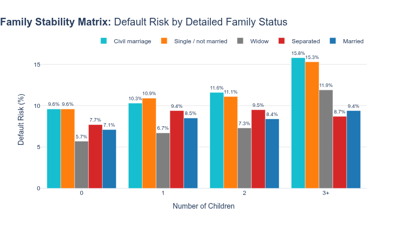


Default risk consistently scales with the number of dependents, peaking sharply for applicants with 3+ children. "Civil marriage" and "Single" applicants represent our highest-risk segments. They begin at a 9.6% default rate with zero children and surge to 15.8% and 15.3% respectively at the 3+ dependents mark. This combination of unmarried status and high dependents requires stricter credit scoring thresholds in our model.

In contrast, "Married" and "Widow" statuses indicate strong financial stability. Widows carry the lowest risk for 0 to 2 children (5.7% to 7.3%), though risk jumps to 11.9% with 3+ children. Standard "Married" applicants are the most stable overall; their marital status effectively buffers the financial strain of dependents. Their default rates remain impressively flat and under 10% across all groups, shifting only from 7.1% (0 children) to 9.4% (3+ children).


## Task 2.  The impact of Education on default risk

**Business Question: Do higher-educated clients handle high debt burdens better than lower-educated clients?**

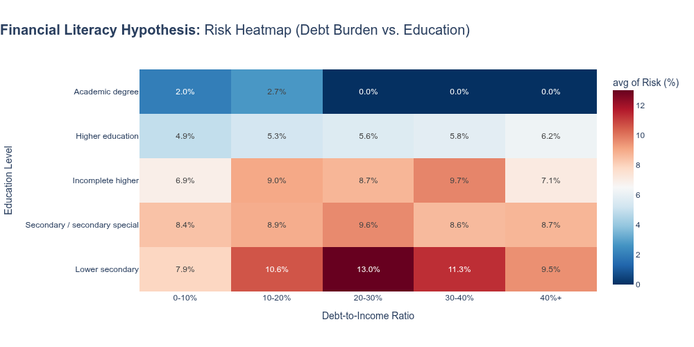

The "image_9e5f5e.png" heatmap clearly supports our literacy hypothesis: formal education acts as a massive buffer against default risk. Applicants with an "Academic degree" present exceptional stability, peaking at just 2.7% for a 10-20% Debt-to-Income (DTI) ratio and dropping to an impressive 0.0% beyond a 20% DTI. Similarly, the "Higher education" group manages debt efficiently, keeping risk contained within a tight 4.9% to 6.2% range across all DTI brackets. These segments are highly resilient.

Conversely, default risk escalates sharply for lower education tiers, especially when debt burdens grow. The "Lower secondary" group represents our most critical risk segment, maxing out at a 13.0% default rate when their DTI reaches 20-30%. Even moderate debt (10-20% DTI) pushes this group to a concerning 10.6% risk. Moving forward, we should strongly consider tightening maximum DTI limits for applicants lacking higher education, as they demonstrate significant vulnerability to debt scaling.


## Task 3. Age & Occupation: The Risky Intersection

**Business Question: How does age and occupation interact to influence default risk? Are younger applicants in certain occupations more prone to default than older applicants in the same field?**

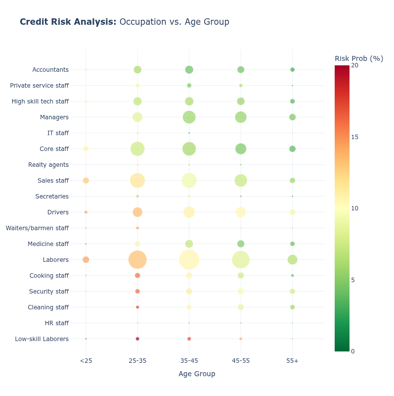

Based on the visualization, default risk is sharply concentrated in younger demographics and manual labor roles. "Low-skill Laborers" carry the highest default probability, approaching the 20% mark for applicants under 35. Similarly, young applicants (<35) in "Security", "Cooking", and "Driver" roles display elevated risks between 10-15%. Conversely, a clear inverse relationship exists between age and risk: default probability steadily declines as age increases, with the 55+ cohort showing highly favorable risk profiles (0-5%) across almost all occupations.

Standard "Laborers" generate our largest applicant volume (peaking between ages 25-55) but hold a moderate, manageable risk of 5-10%. For optimal portfolio stability, "Accountants", "Managers", and "High skill tech staff" are our safest segments, consistently maintaining default probabilities under 5% regardless of their age bracket. Our model should be adjusted to strictly scrutinize young, low-skill applicants while actively favoring established professionals.


##  Task 4. Asset Ownership & Default Risk

**Business Question: How does asset ownership (car, real estate) influence default risk? Are applicants with assets less likely to default than those without?**

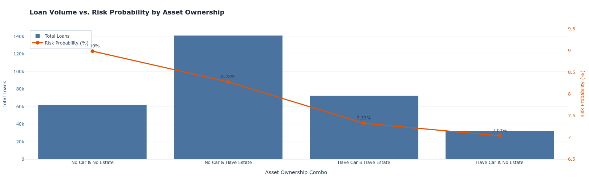

Asset ownership reveals a clear inverse relationship with default risk across our portfolio. Applicants lacking both a car and real estate represent our highest risk segment, demonstrating an 8.99% default probability across roughly 60,000 total loans. Interestingly, while our largest customer base consists of those who own real estate but not a car (peaking at approximately 140,000 loans), this group still carries a moderately high default risk of 8.28%.

Conversely, vehicle ownership emerges as the strongest indicator of financial reliability. Applicants who own both a car and real estate show a substantially lower risk of 7.33% across roughly 70,000 loans. Most notably, the lowest default probability belongs to the "Have Car & No Estate" segment at just 7.04%, despite being our smallest volume group at roughly 30,000 loans. This data strongly indicates our credit scoring model should heavily weight vehicle ownership as a primary risk mitigator, potentially prioritizing it over standard real estate holdings.


## Task 5. The External Score Validation

**Business Question: Is the external credit score (EXT SOURCE 2) equally predictive for small ”Consumer Loans” vs. large ”Cash Loans”?**

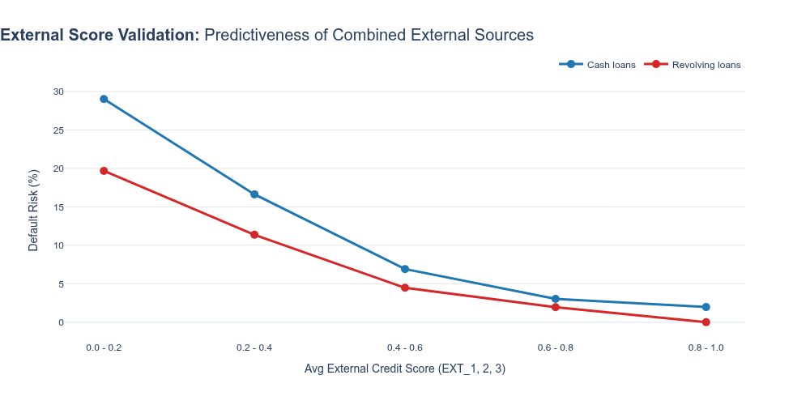

External credit scores are highly predictive of default, with risk rates plummeting as scores improve. In the lowest band (0.0 - 0.2), defaults are critically high, reaching 29.0% for Cash Loans and 19.7% for Revolving Loans. This risk decays rapidly; advancing to the middle tier (0.4 - 0.6) slashes rates down to 6.9% and 4.5%, respectively. For top-tier applicants (0.8 - 1.0), risk is practically negligible, bottoming out at 2.0% for Cash Loans and an impressive 0.0% for Revolving Loans.

Contract type also consistently dictates risk exposure. Across every single score tier, Cash Loans maintain a higher default probability than Revolving Loans. This gap is widest in the lowest tier (a 9.3% difference) and narrows as external scores increase. Moving forward, our scoring model must aggressively restrict Cash Loan approvals in the bottom two tiers (< 0.4) while confidently prioritizing Revolving Loan expansions for applicants scoring above the 0.6 threshold.


## Task 6. The Impact of Housing Quality on Default Risk

**Business Question: Does living in a ”High-Quality” building significantly reduce default risk, and is the ”Absence of Data” (Missing Housing Info) a risk factor in itself?**


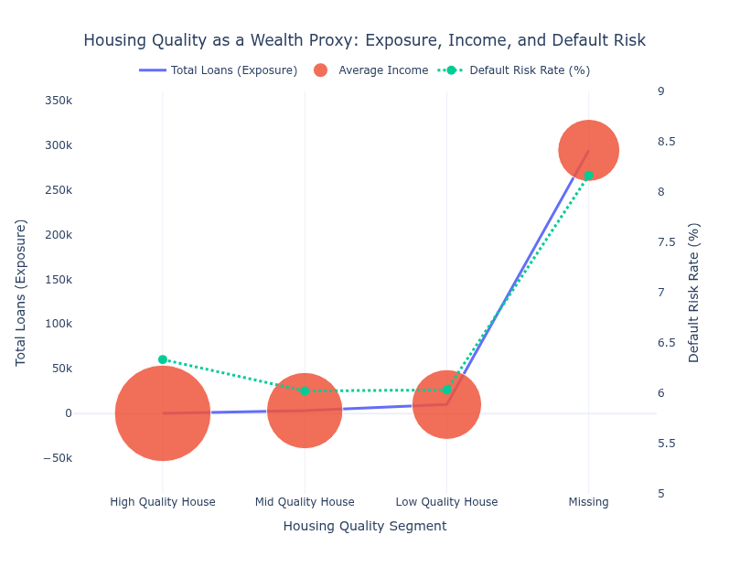

Applicants omitting housing documentation represent our largest loan volume and our highest risk segment. This "Missing" group averages the lowest income at roughly $168,000 and carries a sharply elevated default rate of 8.2%. The failure or refusal by users to provide these documents should not be viewed as a mere administrative blank; rather, it acts as a highly significant behavioral indicator of financial instability and default likelihood.

In stark contrast, when applicants actually submit housing details, default risk stabilizes dramatically—regardless of the actual housing quality. Applicants reporting "Low," "Mid," or "High" quality housing all maintain tightly clustered, significantly lower risk rates between 6.0% and 6.3%, with their average incomes ranging from $190,000 to $265,000. Moving forward, our scoring model must heavily penalize applications lacking housing documents, as the mere act of verifiable reporting correlates with a roughly 2% drop in default probability.


## Task 7.  The Bad Influence of Social Circle on Default Risk

**Business Question: What is the tipping point where a client’s social circle becomes ”Toxic”? (i.e., If ¿10% of your network defaults, do you follow them?)**

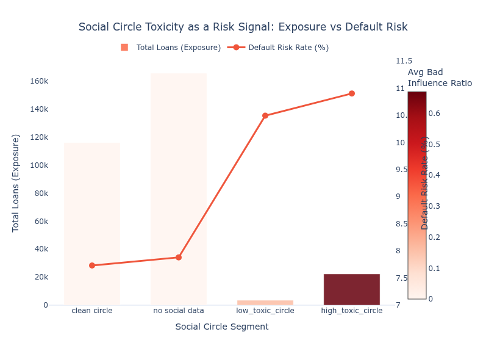


Social circle toxicity acts as a highly effective, early-warning red flag for default probability. The vast majority of our portfolio falls into the "no social data" (over 160,000 loans) and "clean circle" (roughly 115,000 loans) segments. Fortunately, both of these high-exposure groups demonstrate strong stability, maintaining low default risk rates of approximately 7.9% and 7.7%. This confirms that an absence of negative social signals—or having a verified clean network—generally aligns with a safe applicant profile.

However, when social toxicity is detected, default risk escalates dramatically. Applicants in the "low_toxic_circle" and "high_toxic_circle" segments combined account for fewer than 30,000 total loans, yet their default rates surge to 10.4% and a peak of 10.9%, respectively. The "high_toxic_circle" group also displays maximum bad influence ratios. We should deploy strict automated underwriting flags for applicants landing in these toxic tiers, as this isolated social indicator proves to be a powerful and predictive risk multiplier.


# Previous Applications Table - EDA

## Task 8. Impact of Past Refusals on Default Risk

**Objective:**  To determine if a past ”No” from the bank acts as a permanent black mark or if the risk fades over time. A rejection 5 years ago might be irrelevant, but a rejection last month is a massive red flag.

**Business Question:  Does a past refusal predict future default, and does the ”Recency” of that refusal matter? (Is a fresh rejection more dangerous than an old one?)**


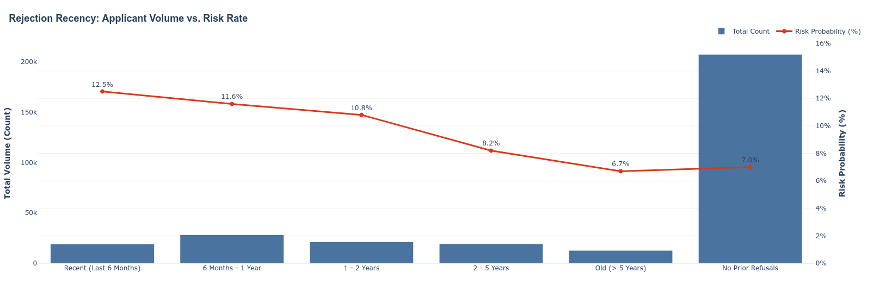

Past credit rejections exhibit a clear "cooling-off" period where default risk decays significantly as time passes. Applicants with a recent refusal within the last 6 months present our highest risk at 12.5%. This elevated risk persists over the short term, remaining critically high at 11.6% for those rejected between 6 and 12 months ago, and 10.8% for the 1-to-2-year cohort.

The vast majority of our portfolio—well over 200,000 applicants—falls into the "No Prior Refusals" category, which establishes a stable baseline default rate of 7.0%. Interestingly, applicants with very old refusals (greater than 5 years) appear to have fully rehabilitated their financial standing, dropping slightly below our clean-slate baseline to a 6.7% default rate, although they represent a much smaller segment of roughly 10,000 loans.

From a policy perspective, our automated underwriting should apply strict penalties to any prior rejection occurring within the last two years, as default probabilities consistently hover above 10%. Conversely, rejections older than 5 years have lost their predictive penalty and can be safely evaluated at our standard baseline rates.


## Task 9: The ”Trust Gap” (Asked vs. Given)

**Objective:** To measure the bank’s historical ”Trust Level” with the client. If the bank previously gave less money than the client asked for (AMT CREDIT ¡ AMT APPLICATION), it means the bank detected risk back then. If they gave more (Upsell), they trusted the client.

**Business Question: Are clients who were previously ”Downgraded” (received less money than they requested) significantly higher risk today compared to those who were ”Upsold”?**


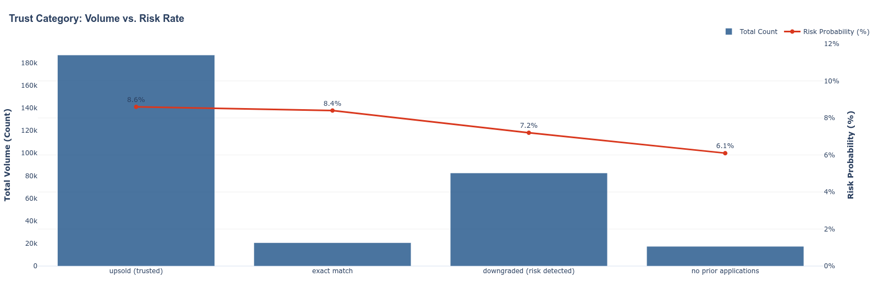

The distribution of applicants across our internal trust categories reveals a critical and highly counter-intuitive trend. Our largest segment by a massive margin—accounting for over 180,000 applications—falls into the "upsold (trusted)" category. However, this group paradoxically carries the highest default probability in the portfolio at 8.6%. The "exact match" segment follows closely with an elevated risk of 8.4%. This strongly indicates that the underlying metrics currently used to designate a customer as "trusted" or suitable for upselling are structurally flawed and are actively capturing high-risk profiles.

Conversely, categories that suggest lower confidence or missing history actually perform significantly better. Applicants explicitly flagged as "downgraded (risk detected)" make up roughly 80,000 of our loans but demonstrate a much safer default probability of 7.2%. The safest segment overall is the "no prior applications" group, which presents a baseline default risk of just 6.1%, despite having no internal track record.

This visual serves as a major red flag for our internal scoring mechanisms. We urgently need to investigate and recalibrate the algorithms defining the "upsold" and "trusted" labels. Currently, we are exposing our largest volume of capital to peak default rates under the false assumption of customer safety, while potentially restricting credit for surprisingly stable segments.


## Task 10. The Pricing History and High Interest Risk Tag


**Objective:** To use historical pricing as a proxy for historical risk. If a client previously accepted loans with ”High” interest rates (NAME YIELD GROUP), it means they were either desperate or assessed as risky by the system in the past. We need to see if this ”High Risk” tag sticks to them.

**Business Question: Do clients who historically accepted ”High Interest” loans continue to be high-risk today, or have they ”graduated” to safer behavior?**

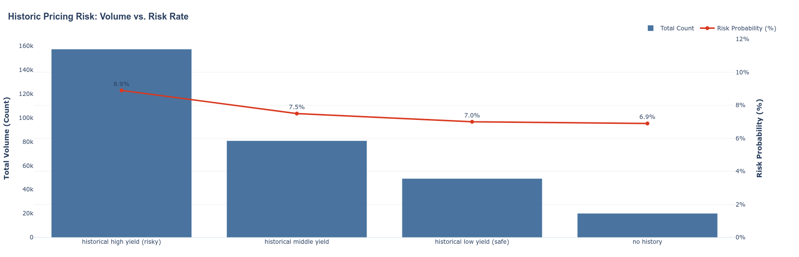

Our portfolio volume is disproportionately concentrated in the "historical high yield" segment, encompassing nearly 160,000 total loans. While this tier drives the vast majority of our business, it also exposes us to the peak default probability at 8.9%. This clear alignment between high historical yield and elevated default risk indicates that our past pricing strategies successfully captured massive volume, but primarily by aggregating riskier applicant profiles.

Moving toward lower historical yields reveals a steady, linear stabilization in credit performance. The "historical middle yield" segment drops the default rate to 7.5% across roughly 80,000 loans, while the "historical low yield" group further improves to a 7.0% risk rate. Interestingly, applicants with "no history" demonstrate the strongest reliability, bottoming out at a 6.9% default risk, though they represent our smallest footprint at approximately 20,000 loans. Strategically, we need to evaluate whether the financial returns on those 160,000 high-yield loans sufficiently offset the nearly 2% absolute jump in default risk compared to our safer, albeit smaller, low-yield segments.


## Task 11. The Lifestyle Risk Matrix

**Objective:** To understand lifestyle risk through purchase history. A client who frequently takes loans for ”Mobile Phones” (short lifespan, high theft/loss risk) might have a different risk profile than someone taking loans for "Furniture" or "Construction Materials" (long-term investment
in stability).

**Business Question: Does the specific ”Category of Goods” purchased in the past predict current creditworthiness?**

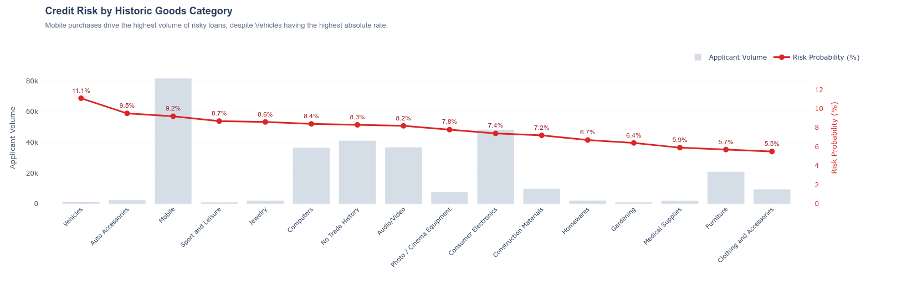


The data demonstrates a wide variance in risk probability based on the type of goods financed. Categories associated with rapid depreciation, high liquidity, or short lifespans exhibit the highest risk profiles: Vehicles top the list at 11.2, followed closely by Auto Accessories (9.8) and Mobile phones (9.2). The "Mobile" category is particularly critical for risk management as it combines a very high risk probability with the largest volume in the high-risk bracket (total_count: 81,547). Conversely, categories linked to domestic stability or long-term utility show drastically lower default rates. Furniture (5.8), Clothing and Accessories (5.6), and Medical Supplies (5.6) represent the safest borrower segments. This suggests that clients investing in home environments or essential well-being are statistically more reliable than those financing transient or luxury electronic goods.

Key Observations for the Report:

- Top Risk Drivers: "Vehicles" (11.2) and "Auto Accessories" (9.8) represent the highest probability of default.
- Volume Risk Alert: "Mobile" phones present a systemic risk; they are the third riskiest category (9.2) but account for a massive share of the volume (81,547 applications).
- Stability Indicators: Purchases related to the home (Furniture at 5.8, Gardening at 6.5, Construction Materials at 7.1) consistently predict safer repayment behavior.


## Task 12. The Insurance Signal: Responsibility vs. Risk Aversion

**Objective:** To test if purchasing insurance (NFLAG INSURED ON APPROVAL) is a behavioral signal of ”Responsibility” or ”Risk Aversion.” We hypothesize that clients who pay extra to insure their loans are more cautious and financially literate..

**Business Question: Does the specific ”Category of Goods” purchased in the past predict current creditworthiness?**


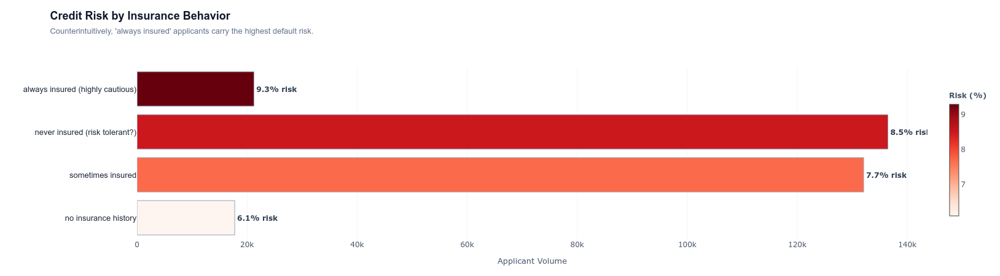

The data contradicts the hypothesis that insurance purchase signals financial caution or literacy. The "always insured (highly cautious)" segment presents the highest risk probability at 9.3. This is significantly higher than the "never insured" cohort, which sits at 8.5. This trend suggests a strong "Adverse Selection" effect: clients who feel the need to insure their loans may be privately aware of their own financial instability or higher likelihood of default. Interestingly, the safest segment is "no insurance history" at 6.1, followed by "sometimes insured" at 7.7, indicating that a lack of engagement with insurance products is actually a positive signal for creditworthiness in this specific context.

Key Observations for the Report:

- Adverse Selection: The highest risk (9.3) comes from those who always buy protection, suggesting they anticipate trouble.
- Risk Tolerance vs. Safety: Clients labeled "risk tolerant" (never insured) perform better (8.5) than the "cautious" (always insured) group.
- Safest Baseline: Clients with no prior history of insurance interaction are the least risky (6.1).


# Payment Analysis - EDA

## Tables required for Payment Analysis

The tables used in this query are the followings: 
- `payments_installments` - shows repayment history for the previously disbursed credits.
- `credit_card_balance` - shows monthly balance snapshots of previous credit cards that applicant has with Home Credit
- `pos_cash_balance` - shows monthly balance snapshots of previous POS (point of sales) and cash loans that the applicant has with Home Credit.
- `applications` - shows current credit specifications. It is used to link the previously explained tables with the default risk rates.


## Task 13. The ”Chronic Late Payer” vs. ”Deteriorating Payer”

**Objective:** To distinguish between a ”Chronic Late Payer” (always 2 days late, but pays) and a ”Deteriorating Payer” (was on time, then 5 days late, then 30 days late). The change in behavior is more predictive than the average.

**Business Question: Does a recent increase in payment delay (e.g., last 3 months vs. last 12 months) predict default more accurately than the overall average delay?**

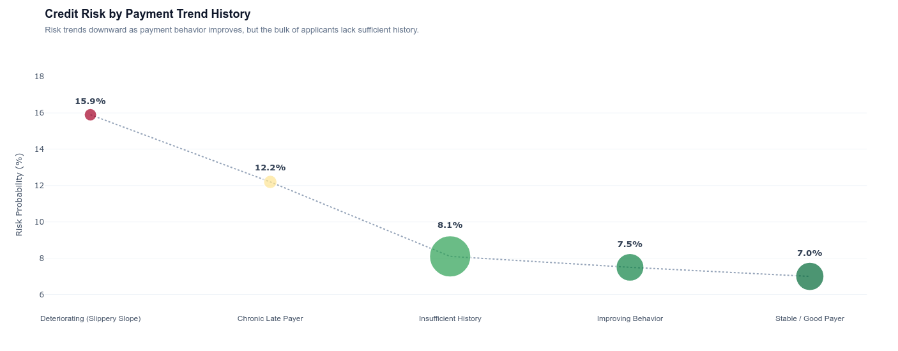


We analyzed the payment trends to see if a change in behavior (getting worse over time) is more dangerous than just being consistently late. The results clearly show that the "Deteriorating (Slippery Slope)" group is our highest risk segment. Even though this group is small (only 5,843 clients), they have a 15.9% default probability. This confirms that when a customer starts paying later than usual, it is a major red flag.

In comparison, the "Chronic Late Payers"—people who are always late but stable—are actually less risky (12.2%) than the deteriorating group. This is an interesting finding because it suggests consistency is better than volatility, even if that consistency involves being a few days late.

For the rest of the population, the trend is positive. Clients with "Improving Behavior" or "Stable" histories are very safe, with default rates dropping to 7.5% and 7% respectively. However, we should be careful with the "Insufficient History" group. They make up the majority of our data (148,093 cases) and have an average risk of 8.1%, mostly because we don't have enough data points to classify them accurately yet.


## Task 14. The ”Partial Payment” Risk Signal

**Objective:** To identify financial distress before it becomes a default. Sometimes clients pay something to keep the bank happy, but not the full amount. This ”Partial Payment” is a huge risk signal.

**Business Question: Are clients who frequently pay less than the required installment amount (even by a small margin) significantly riskier?**


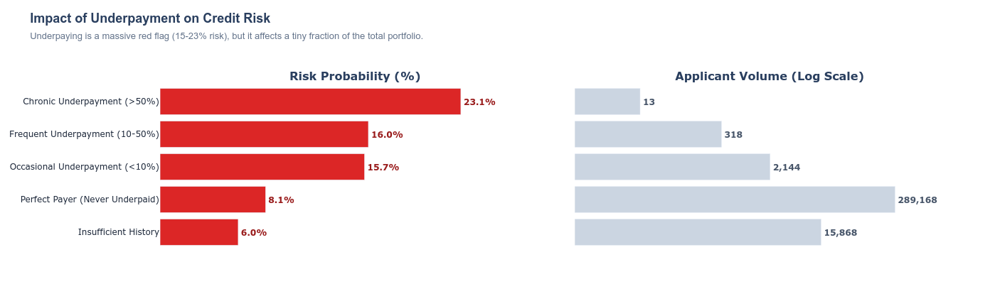


We investigated whether paying less than the full installment amount is an early warning sign of default. The data confirms that any level of underpayment significantly increases risk compared to clients who pay in full.

The most dangerous group is "Chronic Underpayment" (clients who underpay more than half the time). They have the highest default probability at 23.1%. However, this is an extremely rare behavior, with only 13 cases found in the dataset. While the signal is strong, the low volume makes it less critical for broad portfolio impact.

A more significant finding for the business is the "Occasional Underpayment" group. These clients underpay less than 10% of the time, yet their risk level jumps to 15.7%. This is almost double the risk of "Perfect Payers" (8.1%). Since this group is larger (2,144 clients), it represents a meaningful segment of "hidden" risk—clients who might look safe because they pay most of the time, but are actually struggling.

The vast majority of the portfolio (289,168 clients) falls into the "Perfect Payer" category with a stable baseline risk of 8.1%. Interestingly, the "Insufficient History" group shows the lowest risk (6%), likely because these are newer loans that haven't had enough time to go bad yet.


## Task 15. The ”Early Payer” Risk Signal

**Objective:** To check if paying too early is a signal. Sometimes, paying immediately after taking a loan implies the client just needed a bridge loan or is ”churning” (taking bonuses and leaving).

**Business Question: Is there a U-shaped risk curve where paying too early or too late are both risky, while paying ”on time” is the safest behavior?**

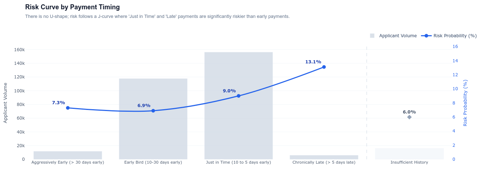

We tested the "U-shaped curve" hypothesis to see if paying too early acts as a risk signal (like potential churn or fraud). The data disproves this hypothesis. Instead of a U-shape, we see a fairly linear trend: the earlier a client pays, the safer they are.

The "Aggressively Early" group (paying 30 days in advance) does not show high risk; in fact, their default probability is very low at 7.3%. The safest segment is actually the "Early Bird" group (paying 10-30 days early), with the lowest risk in the dataset at 6.9%.

The real insight here is about the "Just in Time" payers. These clients, who pay close to the due date (10 to 5 days early), have a significantly higher risk (9%) than the early payers. This suggests that "waiting until the last minute"—even if technically on time—is a sign of tighter cash flow compared to those who pay weeks in advance. As expected, the "Chronically Late" group remains the highest risk at 13.1%.

**Summary: There is no "Early Bird Paradox." Early payment is a strong indicator of financial health, not fraud.**


# External Reputation Analysis - EDA 


## Task 16. 

## Task 17. 

## Task 18. 

## Task 19. 

## Task 20. 


# Feature Engineering

## Applications Table Features

## Previous Applications Table Features

## Payment Analysis Table Features


# Machine Learning Modelling